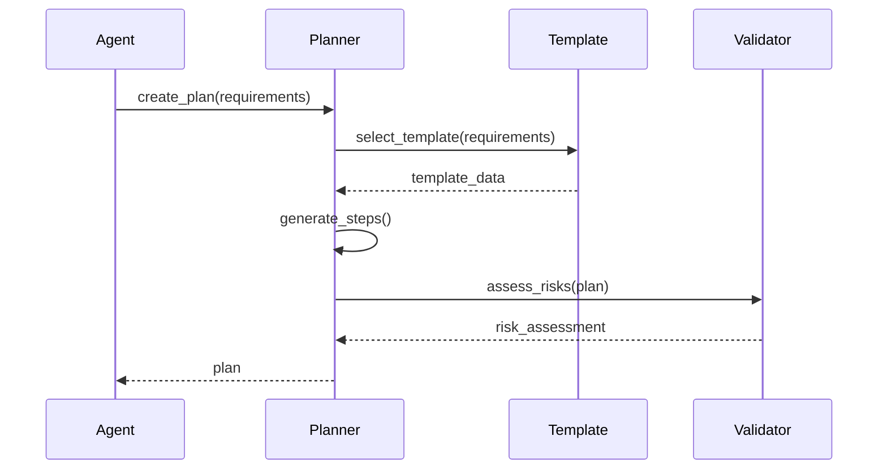
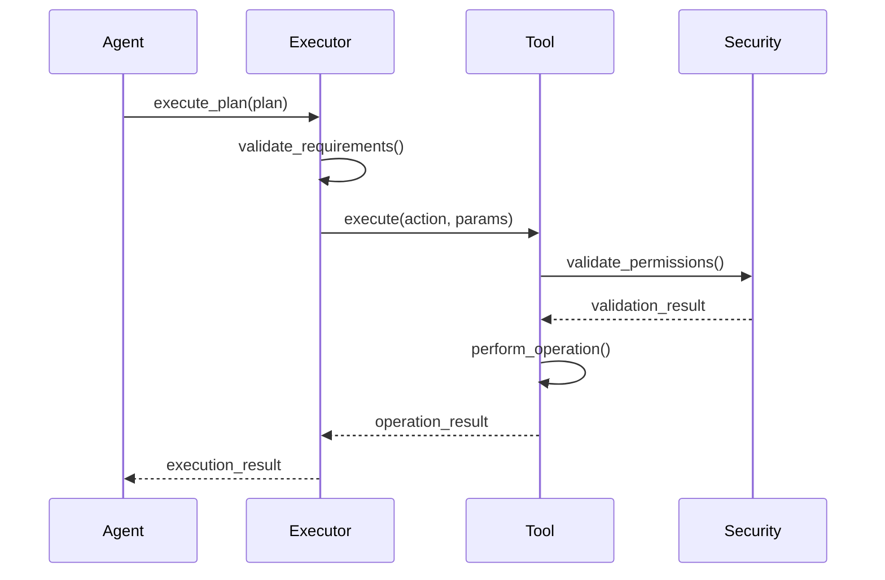

# Architecture

## Overview

Orcastrate follows a hexagonal (ports and adapters) architecture that separates core business logic from external dependencies. This design enables high testability, maintainability, and extensibility.

## Core Components

### Agent Layer

The top-level orchestration layer that coordinates the entire workflow.

```
┌─────────────────────────────────────────────────────┐
│                 Agent Layer                         │
├─────────────────────────────────────────────────────┤
│  • OrcastrateAgent: Main workflow coordinator       │
│  • AgentCoordinator: Multi-agent collaboration      │
│  • Requirements: Natural language processing        │
└─────────────────────────────────────────────────────┘
```

### Planning Layer

Transforms requirements into executable plans.

```
┌─────────────────────────────────────────────────────┐
│                Planning Layer                       │
├─────────────────────────────────────────────────────┤
│  • Planner (Abstract): Planning interface          │
│  • TemplatePlanner: Template-based planning        │
│  • PlanStructure: Plan representation              │
│  • RiskAssessment: Risk analysis                   │
└─────────────────────────────────────────────────────┘
```

### Execution Layer

Executes plans using concrete tools.

```
┌─────────────────────────────────────────────────────┐
│               Execution Layer                       │
├─────────────────────────────────────────────────────┤
│  • Executor (Abstract): Execution interface        │
│  • ConcreteExecutor: Tool-based execution          │
│  • ExecutionContext: Execution state               │
│  • ExecutionResult: Execution outcomes             │
└─────────────────────────────────────────────────────┘
```

### Tool Layer

Concrete implementations for specific operations.

```
┌─────────────────────────────────────────────────────┐
│                 Tool Layer                          │
├─────────────────────────────────────────────────────┤
│  • Tool (Abstract): Tool interface                 │
│  • FileSystemTool: File operations                 │
│  • GitTool: Version control                        │
│  • DockerTool: Containerization                    │
└─────────────────────────────────────────────────────┘
```

### Security Layer

Cross-cutting security concerns.

```
┌─────────────────────────────────────────────────────┐
│                Security Layer                       │
├─────────────────────────────────────────────────────┤
│  • SecurityManager: Permission validation          │
│  • PathValidator: Path traversal protection        │
│  • ResourceLimiter: Resource usage controls        │
└─────────────────────────────────────────────────────┘
```

## Data Flow

### 1. Requirements Processing

```
Natural Language → Requirements → Validation → Structured Data
```

### 2. Plan Generation

```
Requirements → Template Selection → Plan Generation → Risk Assessment
```

### 3. Plan Execution

```
Plan → Validation → Tool Selection → Step Execution → Result Collection
```

## Design Patterns

### Hexagonal Architecture

- **Core**: Business logic independent of external concerns
- **Ports**: Interfaces defining contracts
- **Adapters**: Concrete implementations for external systems

### Template Method Pattern

- Abstract base classes define workflow structure
- Concrete implementations provide specific behavior
- Ensures consistent interfaces across components

### Strategy Pattern

- Pluggable algorithms for planning and execution
- Runtime strategy selection based on requirements
- Easy addition of new strategies

### Observer Pattern

- Event-driven notifications during execution
- Progress monitoring and logging
- Decoupled communication between components

## Component Interactions

### Planning Phase



### Execution Phase



## Module Structure

```
src/
├── agent/                 # Agent layer
│   ├── base.py           # Core models and interfaces
│   └── coordinator.py    # Multi-agent coordination
├── planners/             # Planning layer
│   ├── base.py           # Abstract planner interface
│   └── template_planner.py # Template-based implementation
├── executors/            # Execution layer
│   ├── base.py           # Abstract executor interface
│   └── concrete_executor.py # Tool-based implementation
├── tools/                # Tool layer
│   ├── base.py           # Tool interface and utilities
│   ├── filesystem.py     # Filesystem operations
│   ├── git.py            # Git operations
│   └── docker.py         # Docker operations
├── security/             # Security layer
│   └── manager.py        # Security management
├── cli/                  # Command-line interface
│   └── main.py           # CLI implementation
└── api/                  # REST API (future)
    └── __init__.py
```

## Configuration Management

### Hierarchical Configuration

1. Default values in code
2. System configuration files
3. User configuration files
4. Environment variables
5. Command-line arguments

### Configuration Sources

```python
# Default configuration
DEFAULT_CONFIG = {
    "planner": {
        "strategy": "template_matching",
        "max_plan_steps": 20
    }
}

# File-based configuration
# ~/.orcastrate/config.yaml
# /etc/orcastrate/config.yaml

# Environment variables
# ORCASTRATE_PLANNER_STRATEGY=template_matching

# Command-line overrides
# --planner-strategy template_matching
```

## Error Handling Strategy

### Error Categories

1. **User Errors**: Invalid input, missing requirements
2. **System Errors**: Tool failures, resource constraints
3. **Configuration Errors**: Invalid settings, missing dependencies
4. **Network Errors**: Connectivity issues, timeouts

### Error Recovery

1. **Retry Logic**: Exponential backoff for transient failures
2. **Graceful Degradation**: Continue with available tools
3. **Rollback**: Undo partial changes on failure
4. **User Feedback**: Clear error messages with suggestions

### Error Propagation

```python
try:
    result = await tool.execute(action, params)
except ToolError as e:
    # Log error with context
    logger.error(f"Tool execution failed: {e}")
    # Add to execution context
    context.add_error(step_id, e)
    # Decide on continuation strategy
    if should_continue(e):
        continue
    else:
        raise ExecutionError(f"Critical failure: {e}")
```

## Performance Considerations

### Async/Await Design

- Non-blocking I/O operations
- Concurrent tool execution
- Efficient resource utilization

### Caching Strategy

- Template caching for faster plan generation
- Tool schema caching for validation
- Result caching for repeated operations

### Resource Management

- Connection pooling for external services
- Memory management for large files
- Timeout management for long operations

## Security Architecture

### Defense in Depth

1. **Input Validation**: Sanitize all user inputs
2. **Path Validation**: Prevent directory traversal
3. **Permission Checks**: Validate operation permissions
4. **Resource Limits**: Prevent resource exhaustion
5. **Audit Logging**: Track all operations

### Security Boundaries

```
User Input → Validation → Business Logic → Tool Layer → External Systems
     ↓           ↓             ↓           ↓            ↓
   Sanitize → Authorize → Rate Limit → Sandbox → Monitor
```

## Testing Architecture

### Test Categories

1. **Unit Tests**: Individual component testing
2. **Integration Tests**: Component interaction testing
3. **End-to-End Tests**: Full workflow testing
4. **Performance Tests**: Load and stress testing

### Test Structure

```
tests/
├── unit/                 # Unit tests by component
│   ├── agent/
│   ├── planners/
│   ├── executors/
│   ├── tools/
│   └── security/
├── integration/          # Integration tests
│   └── test_end_to_end.py
└── performance/          # Performance tests
    └── test_load.py
```

### Mock Strategy

- Mock external dependencies (Docker, Git)
- Use real implementations for core logic
- Dependency injection for testability

## Extensibility

### Adding New Tools

1. Inherit from `Tool` base class
2. Implement required methods
3. Register with executor
4. Add configuration options

### Adding New Planners

1. Inherit from `Planner` base class
2. Implement planning strategy
3. Register with agent
4. Add strategy configuration

### Adding New Templates

1. Define template structure
2. Add to template library
3. Configure selection criteria
4. Test with requirements
